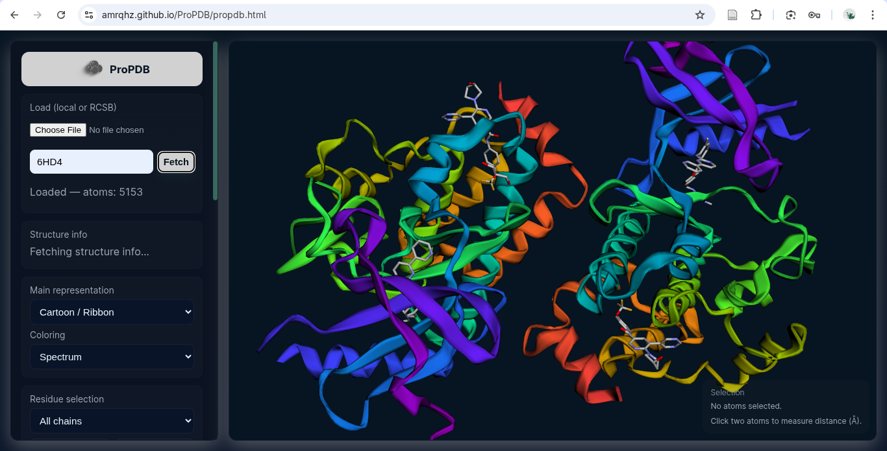

# ProPDB

<div style = "justify-content: center;align-items:center;margin-bottom:2rem">
    
    </img>
</div>

> **A better way to visualize proteins and ligands – simpler than PyMOL.**


ProPDB is an open-source, web-based molecular visualization tool designed to make viewing proteins and their ligands easier and more intuitive than traditional software like PyMOL. It provides a clean, browser-based interface for loading PDB (Protein Data Bank) files, exploring 3D structures, selecting atoms, and performing basic measurements like distances.

---

## Table of Contents

- [Introduction](#introduction)
- [Features](#features)
- [Getting Started](#getting-started)
  - [Prerequisites](#prerequisites)
  - [Accessing the Tool](#accessing-the-tool)
  - [Local Setup for Development](#local-setup-for-development)
- [Usage](#usage)
- [Hands-On Tutorial](#hands-on-tutorial)
  - [Loading a Structure](#loading-a-structure)
  - [Viewing and Interacting with the 3D Model](#viewing-and-interacting-with-the-3d-model)
  - [Measuring Distances Between Atoms](#measuring-distances-between-atoms)
  - [Highlighting Ligands](#highlighting-ligands)
- [Advanced Features](#advanced-features)
- [Troubleshooting](#troubleshooting)
- [Contributing](#contributing)
- [License](#license)
- [Acknowledgments](#acknowledgments)

---

## Introduction

This tool is ideal for researchers, students, and enthusiasts in structural biology who want a quick, no-installation way to inspect molecular models without the steep learning curve of desktop applications.

### Key Benefits

- **Instant Access**: No downloads, plugins, or complex installations
- **Intuitive Interface**: Minimalist design focused on clarity
- **Research-Ready**: Accurate measurements and flexible viewing options
- **Open Source**: Customize and extend the tool to fit your needs

The project is hosted on [GitHub](https://github.com/amrqhz/ProPDB) and deployed via GitHub Pages. The core application is in `propdb.html`, which renders the interactive viewer. For the latest updates, check the GitHub repository.

---

## Features

### **3D Molecular Visualization**
Render protein structures and ligands in an interactive 3D canvas with smooth rotation, zooming, and panning capabilities.

###  **Atom Selection and Measurements**
Easily click atoms to select them and measure distances in angstroms (Å). Perfect for analyzing binding sites and protein-ligand interactions.

###  **User-Friendly Interface**
Minimalist design with clear sections for selections and instructions. No steep learning curve—intuitive interactions feel natural.

###  **No Installation Required**
Runs entirely in the browser. Access it anywhere, anytime, on any device with a modern web browser.

###  **Ligand Focus**
Quick ways to highlight and isolate ligands from the rest of the structure. Ideal for studying protein-ligand interactions.

###  **Cross-Platform Compatibility**
Works seamlessly on desktops, tablets, and mobile devices with modern browsers (Chrome, Firefox, Safari, Edge).

###  **Open Source**
MIT licensed. Customize, extend, and integrate ProPDB into your workflow.

---

## Getting Started

### Prerequisites

- A modern web browser (Google Chrome, Mozilla Firefox, Microsoft Edge, or Safari)
- Internet connection (for initial access; local setup works offline)
- Optional: A PDB file or PDB ID for custom structures

### Accessing the Tool

1. Open your web browser
2. Navigate to the ProPDB website: **https://amrqhz.github.io/ProPDB/propdb.html**
3. The page will load, displaying a brief loading message before showing the main interface

> 💡 **Tip**: Bookmark this page for quick access!

### Local Setup for Development

If you want to run ProPDB locally or contribute to its development:

#### Step 1: Clone the Repository

```bash
git clone https://github.com/amrqhz/ProPDB.git
cd ProPDB
```

#### Step 2: Open in Your Browser

**Option A: Direct (Simple)**
```bash
# Right-click propdb.html → Open with Browser
# or just double-click the file
```

**Option B: Local Server (Recommended for Development)**
```bash
# Using Python 3
python -m http.server 8000

# Using Python 2
python -m SimpleHTTPServer 8000

# Using Node.js
npx http-server
```

Then visit: `http://localhost:8000/propdb.html`

#### Step 3: Make Changes

Edit the following files as needed:
- `propdb.html` – Main application file
- `index.html` – Documentation page
- Other support files (CSS, JavaScript modules, assets)

#### Note
The repository includes assets like `Group 84.svg` (logo) and `LICENSE.txt`. Explore the structure to understand how everything connects.

---

## Usage

ProPDB's interface is straightforward and intuitive:

### Interface Overview

| Component | Description |
|-----------|-------------|
| **3D Viewer Canvas** | Central area displaying the interactive molecular model |
| **Selection Section** | Shows selected atoms and calculated distances in real-time |
| **Control Panel** | Buttons for loading files, adjusting views, and resetting selections |

### Basic Interactions

**Mouse Controls:**
- **Rotate**: Left-click and drag across the model
- **Zoom**: Scroll wheel (or pinch on touch devices)
- **Pan**: Right-click and drag (or middle-click)

**Selection:**
- Click on atoms in the viewer to select them
- Measurements update in real-time in the Selection area
- Clear selection by clicking on empty space or using "Clear Selection" button

---

## Hands-On Tutorial

Follow these step-by-step guides to get the most out of ProPDB.

### Loading a Structure

#### Method 1: Use a Default Structure

1. Visit the ProPDB website
2. A default protein structure will load automatically
3. Wait for the loading message to disappear
4. The 3D model appears in the viewer—you're ready to explore!

#### Method 2: Upload Your Own PDB File

1. Click the **"Upload PDB File"** button
2. Select a `.pdb` file from your computer
3. Alternative: Enter a **PDB ID** (e.g., `1CRN`) and click **"Load"**
   - Example: [Crambin](https://www.rcsb.org/structure/1CRN) is a great test structure
4. The model loads and displays in the viewer

**Popular Test Structures:**
- `1CRN` – Crambin (small protein, ~50 residues)
- `1MBN` – Myoglobin (classic teaching example)
- `2HHB` – Hemoglobin (large multi-chain protein)

### Viewing and Interacting with the 3D Model

#### Navigation Tips

Use your mouse to explore the structure:

| Action | Effect |
|--------|--------|
| **Left-click + Drag** | Rotate the model around X/Y axes |
| **Scroll Wheel** | Zoom in/out smoothly |
| **Right-click + Drag** | Pan the model horizontally/vertically |
| **Hover Over Atoms** | See tooltips with residue information (if enabled) |

#### Changing Representations

Look for representation buttons to toggle between viewing modes:

- **Cartoon** – Secondary structure ribbons (helices, sheets)
- **Stick** – Ball-and-stick atomic model
- **Sphere/CPK** – Space-filling spheres
- **Surface** – Solvent-accessible surface (coming soon)

**Pro Tip**: Cartoon view is great for understanding overall fold; switch to stick view for detailed atomic analysis.

### Measuring Distances Between Atoms

Distance measurement is one of ProPDB's most powerful features for analyzing binding sites and molecular interactions.

#### Step-by-Step Guide

1. **Select the First Atom**
   - Click on an atom in the 3D viewer (e.g., a carbon atom in the protein backbone)
   - The atom should highlight

2. **Select the Second Atom**
   - Click on another atom (e.g., nitrogen in a ligand)
   - The Selection section updates with the distance

3. **Read the Results**
   - The Selection section displays:
     ```
     Selected Atoms:
     - Atom 1: Residue ALA-10, Cα
     - Atom 2: Ligand HET-1, O
     Distance: 4.12 Å
     ```

4. **Reset for Next Measurement**
   - Click on empty space in the 3D viewer, or
   - Click **"Clear Selection"** button
   - Repeat for additional measurements

#### Example Output

```
Selected Atoms:
  ├─ Atom 1: Residue ALA-10, Cα
  └─ Atom 2: Ligand HET-1, O

Distance: 4.12 Å
```

**Common Uses:**
- Analyzing hydrogen bond distances (typically 1.5–3.0 Å)
- Measuring van der Waals contacts
- Validating docking poses
- Studying protein-ligand binding geometry

### Highlighting Ligands

Ligands are small molecules bound to the protein (drugs, cofactors, inhibitors, etc.). ProPDB makes isolating and studying them easy.

#### How to Highlight Ligands

1. **Select Ligand Mode** (if available)
   - Click **"Show Ligands"** or enable the ligand representation
   - Ligand atoms are colored distinctly (often in bright colors)

2. **Click on a Ligand Atom**
   - The entire ligand may highlight or isolate from the protein
   - Zoom in for detailed analysis

3. **Measure Protein-Ligand Interactions**
   - Select a protein atom and a ligand atom
   - Note the distance in angstroms
   - Identify key interactions (hydrogen bonds, π-stacking, etc.)

#### Pro Tips

- **Use Zoom**: After selecting a ligand, zoom in to see the binding site in detail
- **Multiple Measurements**: Measure distances between different residues and ligand atoms to map all interactions
- **Search Filters** (future updates): Look for search boxes to find specific residues or ligands by name
- **Color Coding**: Atoms are colored by element (carbon, nitrogen, oxygen, sulfur) for quick identification

**Example Analysis Workflow:**
```
1. Load a protein-ligand complex (e.g., PDB ID: 1EZQ)
2. Click "Show Ligands" to highlight the bound molecule
3. Zoom to the binding site
4. Select residue atoms and ligand atoms
5. Record distances for key interactions
6. Repeat for all nearby residues
→ You've documented the binding pocket geometry!
```

---

## Advanced Features

### Custom Scripts and Integrations

**For Developers:**
If you're comfortable with JavaScript, embed custom visualization code for advanced applications:

<!-- ```javascript
// Example: Highlight hydrogen bonds
// (Add to propdb.html or custom module)
function highlightHydrogenBonds(atom1, atom2, distanceThreshold = 3.0) {
  const distance = calculateDistance(atom1, atom2);
  if (distance <= distanceThreshold) {
    drawBond(atom1, atom2, 'cyan');
  }
}
``` -->

### Export Options (Upcoming)

- **Save Screenshots**: Capture the 3D view for presentations and papers
- **Export Measurements**: Download a CSV file of all measured distances
- **Share Sessions**: Generate links to pre-loaded structures with specific views

<!-- ### Integration Ideas

- Link with PDB databases for direct fetching of structures
- Connect to UniProt for protein sequence annotations
- Integrate with Lit database for literature context on binding sites
- Export data to molecular dynamics simulation software -->

---

## Troubleshooting

### Page Shows "Loading" Indefinitely

**Symptoms**: The page displays a loading message but never resolves.

**Solutions:**
1. Refresh the page (F5 or Cmd+R)
2. Check your internet connection
3. Disable browser extensions that might block scripts
4. Try a different browser (Chrome, Firefox, Safari)
5. Check the browser console for error messages (F12)

### No 3D Model Visible

**Symptoms**: The page loads but the 3D viewer appears blank or gray.

**Solutions:**
1. Ensure JavaScript is enabled in your browser
2. Try uploading a different PDB file
3. Test with a known working structure (e.g., `1CRN`)
4. Clear browser cache and reload
5. Check if your GPU drivers are up to date
6. Open an issue on GitHub with your browser/OS details

### Selection Not Working

**Symptoms**: Clicking on atoms doesn't select them or show measurements.

**Solutions:**
1. Ensure you're clicking directly on atom spheres (not empty space)
2. Try clicking on larger atoms first (easier targets)
3. Switch to a different representation (e.g., cartoon → stick)
4. Refresh the page and reload the structure
5. Try a different browser
6. Check for JavaScript console errors (F12 → Console tab)

### Insufficient Content Error

**Symptoms**: The page appears mostly empty or shows a blank screen.

**Solutions:**
1. Try accessing the page in **Incognito/Private Mode**
2. Clear browser cookies and cache
3. Disable ad blockers and privacy extensions
4. Try a different browser
5. Check your firewall or network restrictions
6. Visit the GitHub repository to check for known issues

### For More Help

1. **Check the GitHub Issues Page**: https://github.com/amrqhz/ProPDB/issues
2. **Search Existing Issues**: Your problem might already be reported and solved
3. **Open a New Issue**: Include your browser, OS, and what structure you tried to load
4. **Include Diagnostics**:
   - Browser name and version
   - Operating system
   - PDB ID or file name you tried
   - Any error messages from console (F12)

---

## Contributing

We welcome contributions to make ProPDB even better! Whether you're fixing bugs, adding features, or improving documentation, your help is appreciated.

### How to Contribute

#### Step 1: Fork the Repository
Click the **"Fork"** button on GitHub to create your own copy.

#### Step 2: Create a Feature Branch
```bash
git checkout -b feature/your-feature-name
```

Good branch names:
- `feature/file-upload`
- `bugfix/atom-selection-click`
- `docs/improve-tutorial`

#### Step 3: Make Your Changes
Edit files in your local clone. Test thoroughly before committing.

#### Step 4: Commit with Clear Messages
```bash
git commit -m "Add file upload functionality for PDB files"
```

Good commit messages:
- Start with a verb: "Add", "Fix", "Improve", "Refactor"
- Be specific about what changed
- Keep it under 50 characters

#### Step 5: Push to Your Fork
```bash
git push origin feature/your-feature-name
```

#### Step 6: Open a Pull Request
1. Go to your fork on GitHub
2. Click **"Compare & Pull Request"**
3. Write a clear description of your changes
4. Submit the PR

### Areas for Contribution

#### High-Impact Features
- Adding file upload functionality for local PDB files
- Implementing multiple file format support (MOL2, CIF, etc.)
- Creating a search interface for residue/ligand lookup
- Adding keyboard shortcuts for common operations

#### Visualization Enhancements
- Integrating advanced 3D libraries (NGL Viewer, Mol*, Vispy)
- Supporting additional representation modes (Molecular Surface, Density Maps)
- Real-time hydrogen bond visualization
- Secondary structure annotation overlays

#### Quality & Documentation
- Improving this documentation with more examples
- Creating video tutorials
- Writing unit tests
- Adding performance benchmarks
- Creating a comprehensive API reference

#### Bug Fixes
- Check the [Issues page](https://github.com/amrqhz/ProPDB/issues) for reported bugs
- Submit fixes with test cases

### Code of Conduct

Please be respectful and constructive in all interactions. We're all here to improve ProPDB together.

### Development Tips

- **Test Locally**: Use `python -m http.server` before submitting
- **Test Multiple Browsers**: Chrome, Firefox, Safari, Edge
- **Check Mobile**: Use browser DevTools to test on tablets/phones
- **Document Changes**: Update README if adding new features
- **Keep It Simple**: Small, focused changes are easier to review

---

## License

This project is licensed under the **MIT License**. This means you're free to use, modify, and distribute ProPDB for both personal and commercial purposes, provided you include a copy of the license.

---

## Acknowledgments

ProPDB stands on the shoulders of giants:

- **Inspired by PyMOL** and other molecular visualization pioneers
- **Powered by** open-source 3D rendering libraries (Three.js, 3DMol.js, etc.)
- **Data from** the Protein Data Bank (PDB) – an invaluable resource for structural biology
- **Thanks to** the open-source community for contributions, feedback, and support

### Related Resources

- [Protein Data Bank (PDB)](https://www.rcsb.org/) – Download PDB files
- [PyMOL](https://pymol.org/) – Reference implementation for molecular visualization
- [3DMol.js](https://3dmol.org/) – JavaScript library for molecular visualization
- [NGL Viewer](http://nglviewer.org/) – Another excellent web-based molecular viewer

---

## Support & Feedback

If you find ProPDB useful, please consider:

 **Star the repository** on GitHub  
 **Share it** with colleagues and students  
 **Send feedback** via GitHub issues  
 **Contribute** code or documentation  

Your support helps make ProPDB better for everyone!

---

**Happy exploring! 🔬**

For the latest updates, visit the [GitHub repository](https://github.com/amrqhz/ProPDB).